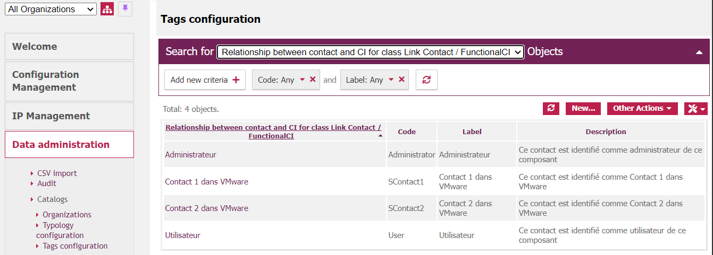
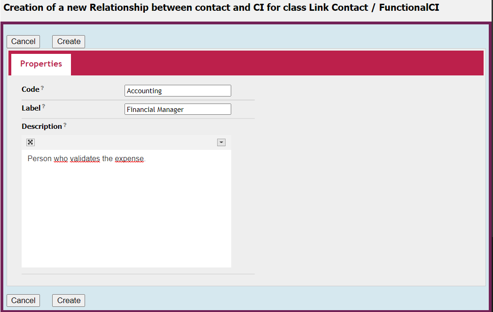
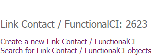
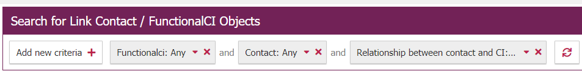
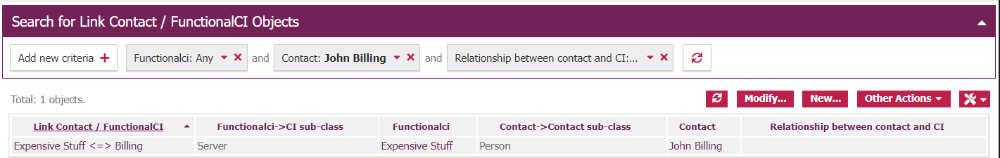
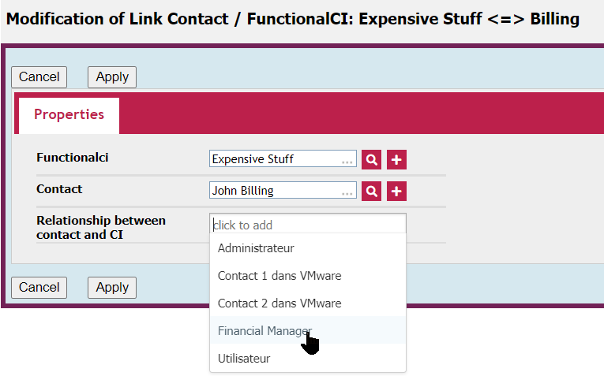
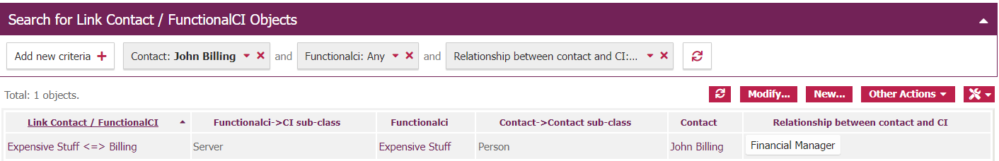

# iTop-Contact-2-CI-Tags
Adds a relationship Tag to the link table between Contacts and CI, to categorize the type of relationship

# Object 
iTop has an embedded relation available between Contacts and Functional CIs. But, in our opinion, this link miss a 'relationship' category.

For example, says that Jon and Jack are in relation with the Database 'Accountings' 

  * Jon is the Account Supervisor (He is a User of the Database)
  * Jack is the Database administrator (He is in charge of the health of the Database)

While the two users are in fact related to the database, their relationship are quite different !

So we choose to add a 'relationship' tag in this relation.

In a complete use of the 'Depends on / Impact' system, it could be a plus that, depending on the tag, some users would be seen as 'impacts' (in our case the DB administrator) and some others would be seen as 'depends on' in our case the Account Supervisor).

# Usage

After installing the extension, a new 'Tag Category' is available.

## Tag creation

The first step is to create all needed tags :

Pictures from iTop 2.7, but this works the same on iTop 3.0.1

In the left menu, choose 

* Data Administration
  
  * Tags Configuration

Then, in the Tags configuration menu, choose in the drop down list on top of the screen  **Relationship between contacts and CI for class Link Contact / FunctionalCI**

You should see something like this (or a message telling that no tags exists yet)

Yes, I'm french :) As far as I know, Tags are not multilingual, so, in case your organization use more than one language, choose carefully your tags language.

You can then add Tags as usual in iTop, using the **New** button

## associating tags on an existing link

Up to iTop 3.0, it is not possible to acts on the tags from either the Contact or the CI view. You have to select the tag in the **Link Contact / Functional CI** view.

In the left menu, choose 

* Configuration Management
  
  * Overview

then select this link : 

If you have more than a lot of links, you probably will appreciate the filters on top of the menu :

After finding the right link :

You can see that, at this time, nothing in 'Relationship'

Select the link, clik modify, and then select the appropriate tag(s) :

Back to the selection table, you can see the updated relationship :

That's all, folks 😊

# Caveats

At least up to iTop 3.0 , the admin GUI doesn't allow the update of tags for links classes. That is, you can see the tags in the GUI, but not update it. This is a known bug, but there's no resolution date or version as far as I know.

This is not a problem in our usage (the 'relationship' tag will most probably be updated by an iTop synchro), but this can be a problem for you 😊

## Update 

Combodo confirm the trouble up to 3.0 and plans to update iTop for that in iTop 3.1. But as for now, it is possible to modify the tags directly in the link. It's not as intuitive as iTop's common way, but it's useable. This extension has been adapted for that, and you can modify a Contact to Functional CI. The Contact 2 FunctionalCI  option is added in the configuration dashboard.

## Download

As for all my extensions, just download the zip file, and copy the 'schirrms-...' directory in your extensions directory, then rerun the setup as usual.